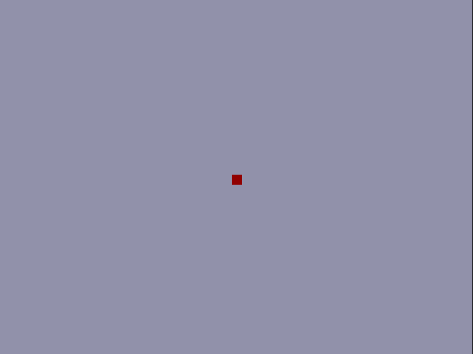

# Changes to allow for simulation

* removed `clk_wiz_o` implementation and directly write `pxl_clk`

* Added testbench that:

    * writes vga signal from vga_top to file:
        * once per `pix_clk` rising edge
        * in format `time timeunits: hsyncbit vsyncbit redvector greenvector bluevector` for use with `vgasim.py` python script
        * ignoring the first clock cycle as variable will be undefined and cause crashes
* Added `vgasim.py` script to convert raw vga signals to images
* Modified `vgasim.py` from https://gist.github.com/pvieito/8cdb54a9a03fd36e51c8df6e331a3006 to accomadate this testbench
    * Changed resolution to 800x600
    * Changed backporch
    * Changed so files are written to the disk instead of displayed

# How to run simulation
1. Create Project in Vivado
2. Add all vhd files as sources except brad_sim.vhd
3. Add brad_sim.vhd as simulation source
4. Modify brad_sim.vhd line 87 to set output file (Note: Will be very large, make sure you have a few gigabytes of space on the disk before running simulation)
5. Run simulation for desired time
6. Run `<path to python install> vgasim.py <path to testbench output>` (Note: Directory named out must exist prior to run, to change output path modify line 127 of `vgasim.py`)
7. To create a gif of the [ffmpeg](ffmpeg.org) is suggested, run the command `ffmpeg -r 60 -i %05d.png ball.mp4` to create a video output

Example: 

# Lab 3: Bouncing Ball

* Program the FPGA to display a "bouncing ball" on a 800x600 Video Graphics Array (VGA) monitor (See Section 8 on VGA Port and Subsection 8.1 on VGA System Timing of the [Reference Manual]( https://reference.digilentinc.com/_media/reference/programmable-logic/nexys-a7/nexys-a7_rm.pdf))

* 2019-11-03 pull request by Peter Ho with the 800x600@60Hz support for 100MHz clock

### 1. Create a new RTL project VGAball in Vivado Quick Start

* Create five new source files of file type VHDL called clk_wiz_0, clk_wiz_0_clk_wiz, vga_sync, ball, and vga_top

* Create a new constraint file of file type XDC called vga_top

* Choose Nexys A7-100T board for the project

* Click 'Finish'

* Click design sources and copy the VHDL code from clk_wiz_0.vhd, clk_wiz_0_clk_wiz.vhd, vga_sync.vhd, ball.vhd, and vga_top.vhd

* Click constraints and copy the code from vga_top.xdc

### 2. Run synthesis

### 3. Run implementation and open implemented design

### 4. Generate bitstream, open hardware manager, and program device

* Click 'Generate Bitstream'

* Click 'Open Hardware Manager' and click 'Open Target' then 'Auto Connect'

* Click 'Program Device' then xc7a100t_0 to download vga_top.bit to the Nexys A7 board

### 5. Change the size and color of the ball

### 6. Change the square ball to a round ball

### 7. Introduce a new signal ball_x_motion to allow the ball to move both horizontally and vertically
